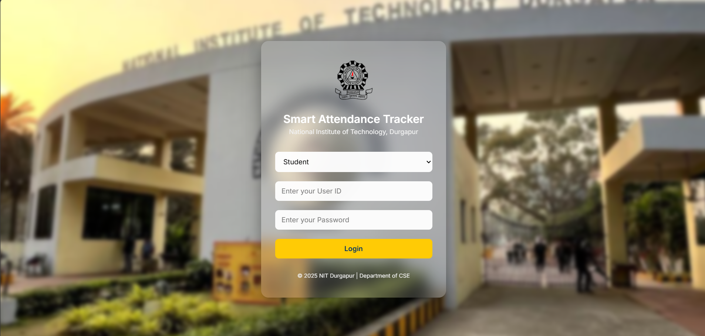

# Attendance Tracker with Geolocation 📍🧑‍💻

## 📋 Project Overview
This is a **web-based Attendance Tracker** built using modern technologies. The system helps educational institutions track student attendance more securely and efficiently by verifying users through **geolocation**. Students can mark attendance only when they are within the permitted location.

---

## 🚀 Features
✅ **User Authentication** – Secure login for students and admins  
✅ **Geolocation Verification** – Attendance can be marked only when users are within the allowed area  
✅ **Real-Time Attendance Tracking** – Instant updates on student attendance  
✅ **Responsive Design** – Works across devices  
✅ **Clean UI/UX** – Simple and easy-to-use interface  

---

## 📍 Geolocation Feature
The application uses the browser’s Geolocation API to verify the student’s location before allowing them to mark attendance. This ensures that students can only check in when they are physically present in the designated area.

---

## 📸 Screenshots

### ✅ Landing Page

### ✅ Attendance Check-in (Geolocation Verified)

---

